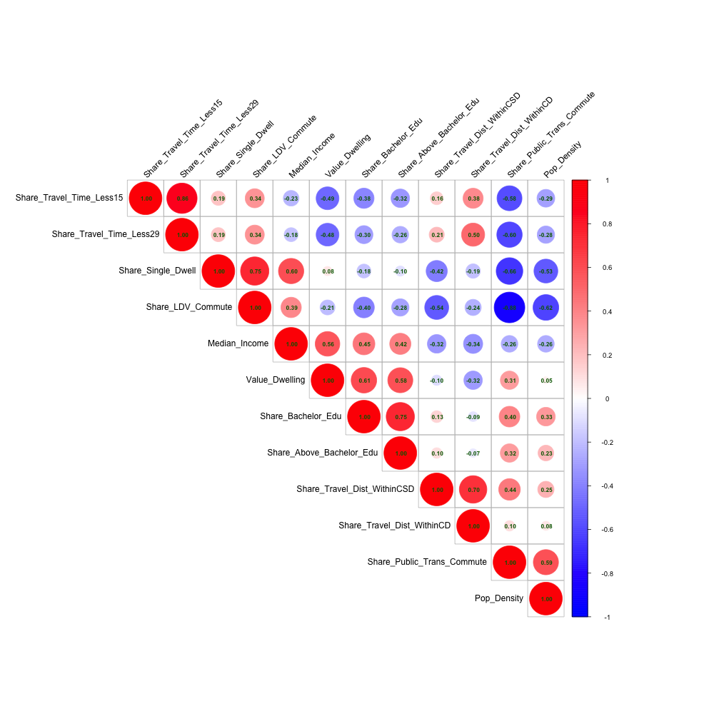
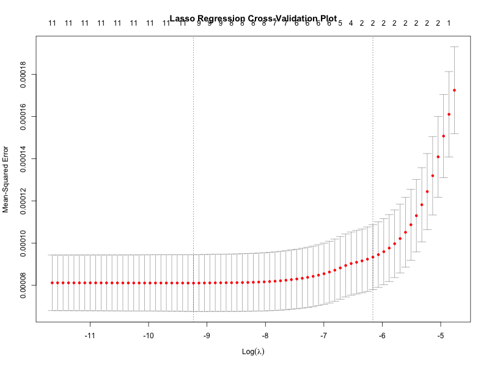

# zev_map_and_analysis
Statistical analysis of Zero-Emission Vehicle (ZEV) correlates in terms of census data variables, as well as interactive map of ZEV registrations for the Ontario, Canada.

## Analysis and plots

The analysis includes a lasso regression (in R) of ZEV ownership (per population) against various household characteristics (income, housing type, etc.) at the census tract level for Ontario, Canada. The program produces a number of plots as well.
* histograms 
* box plots
* density plots
* correlogram
* regression diagnostics

## Interactive map of registrations

The interactive map uses R Shiny for its interactivity, showing registrations and registrations per capita at the census tract level, for Ontario, Canada.

[The registration dashboard for Ontario can be viewed here](https://tonympeluso.shinyapps.io/ZEV_Registrations_Ontario)
